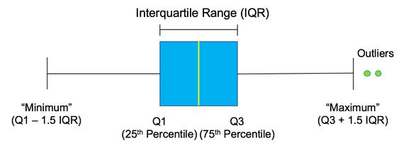

# Feature-Engineering-ML
Feature Engineering techniques for ML

### Different types of data
1. Continuos : either integers(or whole numbers) or floats(decimals)
2. Categorical : one of a limited set of values e.g gender, country
3. Ordinal : ranked values, often with no detail of distance between them
4. Boolean : True/False
5. Datetime : dates and times

#### Selecting specific data types

```python
only_ints = df.select_dtypes(include=['int'])
print(only_ints.column)
```

### Categorical variables
- Represents groups that are qualitative in nature.
- We need to encode them as numeric values to use them in ML models. Assigning each category with number can lead to errors.
- These categories are unordered, so assigning this order may greatly penalize the effectiveness of our model. Assiginig number would imply some form of ordering to the categories.
- Instead we can use techniques like one-hot encoding, in doing so our model can leverage the information of what country is given, without inferring any order between the different options.

#### Encoding categorical features
1. One-hot encoding : by default, pandas performs one-hot encoding when we use the get_dummies() function.
- One hot encoding converts n_categories into n_features. We can use get_dummies to one-hot encode columns. The function takes a Dataframe and a list of categorical columns to be converted.

```python
pd.get_dummies(df, columns=['Country'], prefix = 'C')
```

2. Dummy encoding

```python
pd.get_dummies(df, columns=['Country'], drop_first=True, prefix='C')
```

- Dummy encoding creates n-1 features for n categories, omitting the first category.

### Numeric variables

#### Types of numeric features
- Age
- Price
- Counts
- Geospatial data


- Depending on the usecase numeric features can be treated in several different ways.

#### Binarizing numeric variables
- Variable with value 0 is 0 and any other value is 1.

```python
df['Binary_Violation'] = 0
df.loc[df['Number_of_Violations'] > 0, 'Binary_Violation'] = 1
```

#### Binning numeric varaibles
- Often useful for features like age, wage brackets etc.

```python
import numpy as np
df['Binned_Group'] = pd.cut(df['Number_of_Violations'],
                    bins=[-np.inf, 0, 2, np.inf],
                    labels = [1,2,3]
                    )
```

### Dealing with missing values

#### Listwise deletion in Python

```python
# drop all rows with atleast one missing value
df.dropna(how='any')

# drop rows with missing values in a specific column
df.dropna(subset=['VersionControl'])
```

#### Issues with deletion
- It deletes valid data points
- If the missing value does not occur entirely at random it can negatively affect the model.
- If we remove a feature instead of row, it can reduce the degrees of freedom of our model.

#### Replacing with strings
- Most comming way to deal with the missing values is to simply fill these values using the `fillna()` method.
- In case of categorical columns, it is common to replace missing values with strings like 'Other', 'Not Given' etc.

```python
# replace missing values in a specific column with a string
df['VersionControl'].fillna(value='None Given', inplace=True)
```

#### Recording missing values

```python
# record where the values are not missing
df['SalaryGiven'] = df['ConvertedSalary'].notnull()

# drop a specific column
df.drop(columns = ['ConvertedSalary'])
```

#### Dealing with bad characters

```python
df['RawSalary'] = df['RawSalary'].str.replace(',', '')

df['RawSalary'] = df['RawSalary'].astype('float')
```

#### Finding other stray characters
- Instead of manually searching for values with other stray characters we can use `to_numeric()` function from pandas along with the errors argument.
- If we set the errors argument to `coerce` ,pandas will convert the column to numeric but all values that can't be converted to numeric will be changed to NaNs, that is missing values.
- Then we can use `isna()` method to find out which values failed to parse

```python
print(df[coerced_vals.isna()].head())
```

### Chaining methods

```python
df['column_name'] = df['column_name'].method1()
df['column_name'] = df['column_name'].method2()
df['column_name'] = df['column_name'].method3()
```

- same as

```python
df['column_name'] = df['column_name'].method1().method2().method3()
```

### Data distributions
- An important consideration before building a ML model is to understand what the distribution of our underlying data looks like. A lot of algorithms make assumptions about how our data is distributed or how different features interact with each other.
- For e.g, almost all models besides tree based models require our features to be on the same scale. Feature engineering can be used to manipulate our data so that it can fit the assumptions of the distribution, or atleast fit it as closely as possible.
- Almost every model besides tree based models assume that our data is normally distributed.


- Normal distributions follow a bell shape like shown above, the main characteristics of normal distribution is that 68% of the data lies within 1 standard deviation of the mean, 95% lies within 2 standard deviations from the mean and 99.7% falls within 3 standard deviations from the mean.

#### Observing data
- To understand the shape of the data we can create histograms of each of the continuos features.

```python
import matplotlib.pyplot as plt

df.hist()
plt.show()
```

#### Delving deeper with box plots
- While histograms can be useful to show the high level distribution of the data, it does not show details such as where the middel chunk of our data sits in an easily readable fashion.For this we can use the box plot.



- The box plot shows the distribution of the data by calculating where the middle 50% of the data sits. This is also known as the `Inter Quartile range` or `IQR` (it sits between the 1st and 3rd quartile) and marking it with the box.
- The whiskers extends to the minimum of 1.5 * IQR from the edge of the box or the minimum range of the data. Any points outside this are marked as outliers. This can be useful to also see if there are points in our data set taht may be unwanted outliers.

```python
df[['column']].boxplot()
plt.show()
```

#### Pairing distributions
- One approach to looking at the distribution of data is to examine how different features in our DataFrame interact with each other. This type of chart is called a pairplot and can be useful to see if multiple columns are correlated with each other or whether they have any association at all.

```python
import seaborn as sns
sns.pairplot(df)
```

#### Further details on our distributions

```python
df.describe()
```

### Scaling and transformation
- Most ML algorithms require our data to be on the same scale for them to be effective. For e.g, its often difficult to compare salary values(often measured in thousands) with ages. For this reason we need to rescale our data to ensure that it is on the same scale.
- Min-Max scaling (sometimes referred to as normalization), and standardization.

#### Min-Max scaling
- Min-Max scaling is when our data is scaled linearly between a minimum and maximum value, often 0 and 1, with 0 corresponding with lowest value in the column, and 1 with the largest.
- As it is a linear scaling while the values will change, the distribution will not.

```python
from sklearn.preprocessing import MinMaxScaler

scaler = MinMaxScaler()

scaler.fit(df[['Age']])

df['normalized_age'] = scaler.transform(df[['Age']])
```

#### Standardization
- Standardization finds the mean of our data and centers our distribution around it, calculating the number of standard deviations away from the mean each point is.
- These values (the number of standard deviations) are then used as our new values. This centers the data around 0 but technically has no limit to the maximum and minimum values.

```python
from sklearn.preprocessing import StandardScaler

scaler = StandardScaler()

scaler.fit(df[['Age']])

df['standardized_col'] = scaler.transform(df[['Age']])
```

#### Log transformation
- Both normalization and min-max scaling are types of scalers, in other words the data remained in the same shape but was squashed or scaled.
- A log transformation on the other hand can be used to make a highly skewed distribution less skewed.

#### Log transformation in Python

```python
from sklearn.preprocessing import PowerTransformer

log = PowerTransformer()

log.fit(df[['ConvertedSalary']])

df['log_ConvertedSalary'] = log.transform(df[['ConvertedSalary']])
```

#### When can we use normalization?
- When we know the the data has a strict upper and lower bound. Normalization scales all points linearly between the upper and lower bound.

### Removing outliers
- We will often find that even after performing this transformations our data is very skewed. This can often be caused by outliers existing in our data.

#### Outliers
- Outliers are data points that exist far away from majority of our data. We often remove these values as they can negatively impact our models. An example of the negative effect can be seen when an outlier causes almost all of the scaled data to be squashed to the lower bound.

#### Quantile based detection
- Remove certain percentage of the largest or smallest values in our data. For example, we can remove top 5%. This is achieved by finding 95th quantile ( the point below which 95% of the data resides) and removing everything above it.
- This approach is particularly useful if we are concerned that the highest values in our dataset should be avoided.
- When using this approach we must remember that even if there are no real outliers, we will still be removing top 5% of values from the dataset.
- To find the 95th quantile, we can call the quantile() method with 0.95 as the argument on the column.

#### Quantiles in Python

```python
q_cutoff = df['col_name'].quantile(0.95)

mask = df['col_name'] < q_cutoff

trimmed_df = df[mask]
```

#### Standard deviation based detection
- Based on the mean and std-dev of the dataset. For e.g, we might want to eliminate all data greater than 3 standard deviations from the mean as we expect those data points to be outliers.
- This approach has the benefit of only removing genuinely extreme values, for e.g if only one value was an outlier, only that value would be effected.

```python
mean = df['col_name'].mean()
std = df['col_name'].std()

cut_off = std * 3

lower, upper = mean - cut_off, mean + cut_off

new_df = df[(df['col_name'] < upper) & (df['col_name'] > lower)]
```

### Scaling and transforming new data
- One of the important aspects of ML is the actual application of any model we create on a new data set. For e.g, if we built a model based on historical data, ultimately we will apply this model on new data to make predictions.
- How we go about doing this depends on what transformations we make to the dataset before we fit the model. For e.g if we apply StandardScaler() to our data before fitting the model, we need to make sure we transform the test data using the same scalar before making predictions.
- The scalar is fitted only on the training data. i.e we fit and transform the training data, but only transform the test data.

#### Reusing training scalers

```python
scaler = StandardScaler()
scaler.fit(train[['col']])
train['scaled_col'] = scaler.transform(train[['col']])

# FIT SOME MODEL
# ...

test = pd.read_csv('test.csv')
test['scaled_col'] = scaled.transform(test[['col']])
```

#### Training transformations for reuse
- If we intend to remove outliers from the test set, we should use the thresholds found on our train set to do so.
- If we use the mean and std-dev of the test set, it could negatively impact our predictions.
- In very rare cases, we would want to remove outliers on our test set.

#### Why only use training data ?
- Why do we not refit the scaler on the test data or use thresholds from the test data ? **To avoid data leakage**
- **`Data leakage`** : Using data that we won't have access to when assessing the performance of our model.
- In real life, we won't have access to the test data, that is when we have deployed our model in production,we won't have access to future data, so we can't rely on it to make predictions and assess model performance.
- Thus, we should always make sure we calibrate our preprocessing steps only on our training data or else we will overestimate the accuracy of our models.


